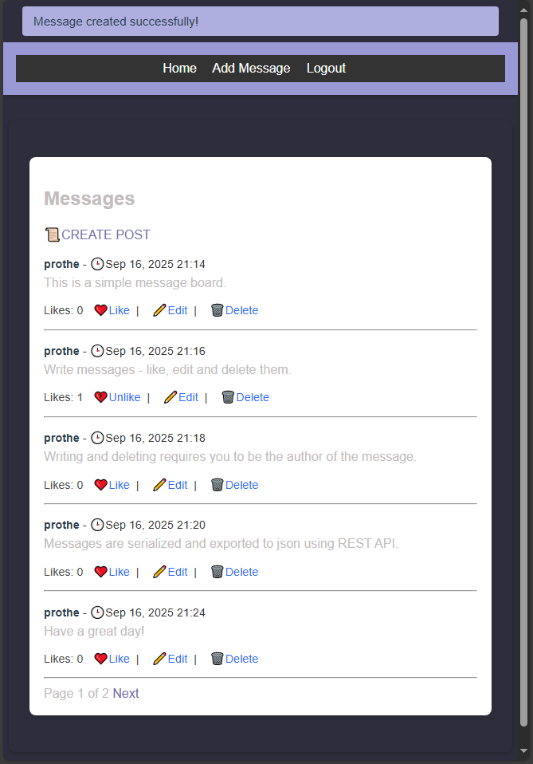

# Django Message Board

A simple **Django-based message board** for learning purposes.  

Users can:

- Log in and log out
- Post messages
- Edit and delete their own messages
- Like/unlike messages

This project is designed as a practice project to learn Django basics:

- Class-based views (`ListView`, `CreateView`, `UpdateView`, `DeleteView`)
- User authentication
- Template rendering and static files
- Basic CRUD functionality
- Many-to-many relationships (likes)
- REST API

Notes:

- This project is for learning purposes only.
- Styling is minimal.
- No production-ready authentication or security measures implemented.